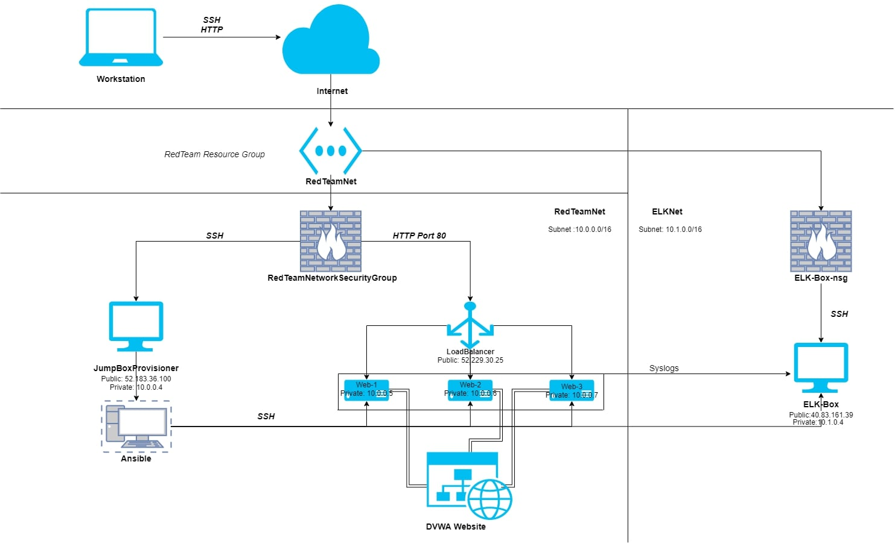

## Automated ELK Stack Deployment

The files in this repository were used to configure the network depicted below.
  

These files have been tested and used to generate a live ELK deployment on Azure. They can be used to either recreate the entire deployment pictured above. Alternatively, select portions of the Ansible folder may be used to install only certain pieces of it, such as Filebeat.

  - [install-elk.yml](Ansible/install-elk.yml)
  - [filebeat-config.yml](Ansible/filebeat-config.yml)
  - [filebeat-playbook.yml](Ansible/filebeat-playbook.yml)
  - [metricbeat-config.yml](Ansible/metricbeat-config.yml)
  - [metricbeat-playbook.yml](Ansible/metricbeat-playbook.yml)

This document contains the following details:
- Description of the Topology
- Access Policies
- ELK Configuration
  - Beats in Use
  - Machines Being Monitored
- How to Use the Ansible Build

### Description of the Topology

The main purpose of this network is to expose a load-balanced and monitored instance of DVWA, the D*mn Vulnerable Web Application.

Load balancing ensures that the application will be highly reliable, in addition to restricting network access to the network.
- _Load balancers protect website deployemnts by making a Denial of Service attack require much more thorughput. By seperating traffic between many servers, they can provide a more reliable system with higher uptime. They do not need all of the servers to be online in order to function correctly._
- _A jumpbox provides an organization security and ease of access to their network. By providing a single place to connect to that has access to the rest of the network, the network can maintain a higher security stance than would normally be allowed if you had to connect to individual machines inside of it._

Integrating an ELK server allows users to easily monitor the vulnerable VMs for changes to the file systems and system metrics.
- _Filebeat is used to wath the log output of the webservers._
- _Metricbeat monitors the system metrics of the webservers_

|         Name         |  Function  | IP Address | Operating System |
|:--------------------:|:----------:|:----------:|:----------------:|
| Jump-Box-Provisioner |   Gateway  |  10.0.0.4  |       Linux      |
|        ELK-Box       | ELK Server |  10.1.0.4  |       Linux      |
|         Web-1        |  Webserver |  10.0.0.5  |       Linux      |
|         Web-2        |  Webserver |  10.0.0.6  |       Linux      |
|         Web-3        |  Webserver |  10.0.0.7  |       Linux      |

### Access Policies

The machines on the internal network are not exposed to the public Internet. 

Only the Jumpbox machine can accept connections from the Internet. Access to this machine is only allowed from the following IP addresses:
- _73.202.25.239_
- _67.181.84.126_

Machines within the network can only be accessed by eachother.
- _To access the ELK-Box, you must connect through SSH from the ansible container on the Jumpbox._

A summary of the access policies in place can be found in the table below.

|         Name         | Publicly Accessible |     Allowed IP Addresses    |
|:--------------------:|:-------------------:|:---------------------------:|
| Jump-Box-Provisioner |         Yes         | 73.202.25.239,67.181.84.126 |
|        ELK-Box       |          No         |         10.0.0.0/16         |
|         Web-1        |          No         |         10.0.0.0/16         |
|         Web-2        |          No         |         10.0.0.0/16         |
|         Web-3        |          No         |         10.0.0.0/16         |

### Elk Configuration

Ansible was used to automate configuration of the ELK machine. No configuration was performed manually, which is advantageous because...
- _Deployment can be replicated and automated as needs require._

The playbook implements the following tasks:
- _Install Dockerio, python3-pip, and Docker_
- _Increase virtual memory for the elk container_
- _Download and launch an ELK 7.9.1 container using Docker with published ports 5044, 5601, and 9200_

The following screenshot displays the result of running `docker ps` after successfully configuring the ELK instance.

### Target Machines & Beats
This ELK server is configured to monitor the following machines:
- _10.0.0.5_
- _10.0.0.6_
- _10.0.0.7_

We have installed the following Beats on these machines:
- _Filebeat_
- _Metricbeat_

These Beats allow us to collect the following information from each machine:
- _Filebeat collects logdata from the webservers. It is configured to collect Apache logs._
- _Metricbeat collects system metrics such as CPU/RAM usage as well as detech SSH logins anf failed 'sudo' escalations._

### Using the Playbook
In order to use the playbook, you will need to have an Ansible control node already configured. Assuming you have such a control node provisioned: 

SSH into the control node and follow the steps below:
- Copy the playbook file to Ansible container on Jump-Box.
- Update the hosts file to include the ELK-Box ip and python interpreter location.
- Run the playbook, and navigate to the public ip of the ELK-Box on port 5601 (i.e. http://40.83.161.39:5601) to check that the installation worked as expected.

- _install-elk.yml should be moved to your ansible container and executed with the command: ansible-playbook.yml_
- _In the install-elk.yml file, the (hosts:) should be elk rather than webserver to ensure that the ELK container is installed on the machine you want ELK installed on._
